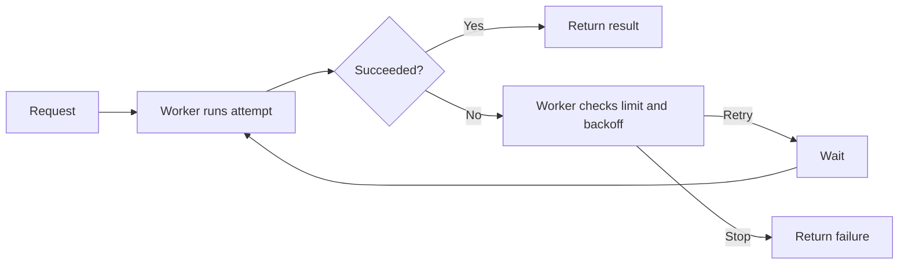
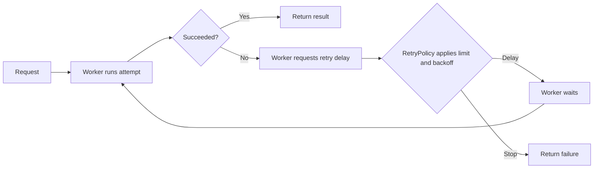

# Example: refactor choices for a worker

Illustrative choices only. These are not claims about a real codebase.

Target: illustrative worker. Revision: example only. Date: 2026-09-26.
This is Sol's handoff to Luna; a real handoff supplies source locations for every choice.

## Three choices

| Choice | Evidence and payoff | First slice | Tradeoff |
| --- | --- | --- | --- |
| **1. RetryPolicy — recommended** | Illustrative: `Worker.run` mixes attempt execution with retry-limit and backoff decisions. Moving the policy makes decisions independently testable. | Extract `next_delay(result, attempt)` and delegate one worker. | Adds one narrow policy interface. |
| **2. RequestFactory** | Illustrative: `Worker.run` also assembles provider requests. Isolating construction makes payload rules easier to review and test. | Extract request construction; preserve the payload contract. | May offer little benefit if payload assembly is already short. |
| **3. ResultPublisher** | Illustrative: `Worker.run` formats outcomes and invokes delivery callbacks. A delivery owner could reduce branching in orchestration. | Extract result formatting while preserving callback order. | Callback ordering needs integration coverage. |

## Recommendation

Start with **RetryPolicy**. It has a narrow boundary and keeps the worker responsible for attempt execution and waiting. The other choices remain viable follow-ups; verify their source evidence before prioritizing them.

## Before and target: RetryPolicy

### Before

### Target

## Recommended design and first PR

- `Worker` owns attempt execution, waiting, and result delivery. `RetryPolicy.next_delay(result, attempt)` returns a delay or `None` when retries stop.
- Add the policy and route one worker through the interface. Preserve attempt limits, backoff, and failure propagation; defer other callers.
- Illustrative affected files: `retry_policy.py`, `worker.py`, and focused policy tests. Deferred: the second caller and the other two choices.

## Evidence and checks

- **Proposed improvement:** the policy can be tested without constructing the worker. This example has no source evidence; a real proposal cites exact files and symbols for all three choices.
- **Proposed check:** cover just below, at, and above the attempt limit; retain one integration check for retry ordering.
