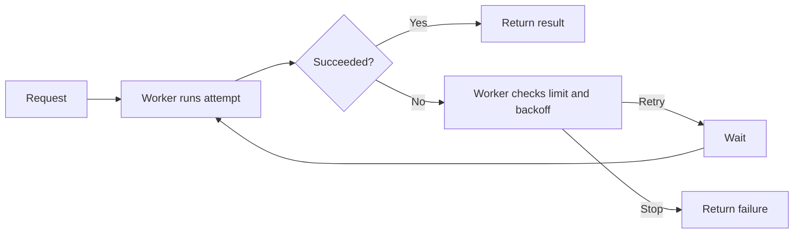
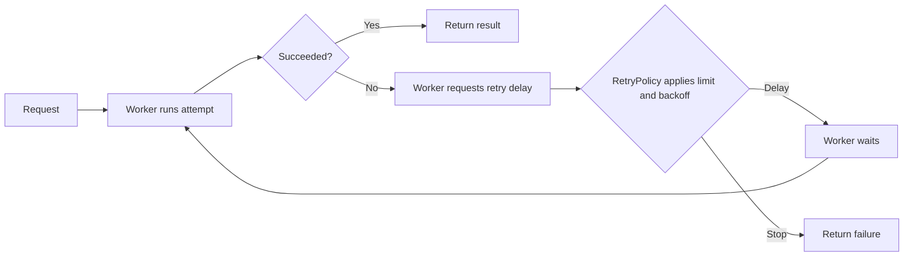

# Example: give retry decisions one owner

Illustrative proposal only; this does not report a confirmed runtime defect.

## Recommendation

Move retry-limit and backoff decisions from `Worker` into `RetryPolicy`. The worker keeps attempt execution and result delivery; the retry rule becomes independently testable.

## Before and target

### Before

### Target

## Target design

- `Worker` owns attempt execution, waiting, and result delivery.
- `RetryPolicy.next_delay(result, attempt)` returns a delay or `None` when retries stop.

## Evidence and validation

- **Proposed improvement:** isolated policy tests can avoid constructing the worker. This example has no source evidence.
- **Proposed check:** cover retry just below, at, and above the attempt limit; keep one integration check for retry ordering.

## First PR

- Add `RetryPolicy` and route one worker through its narrow interface.
- Preserve attempt limits, backoff, and failure propagation; defer other callers.
